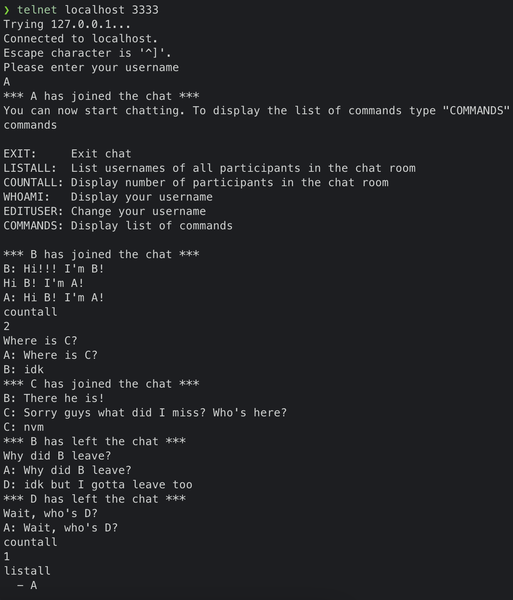
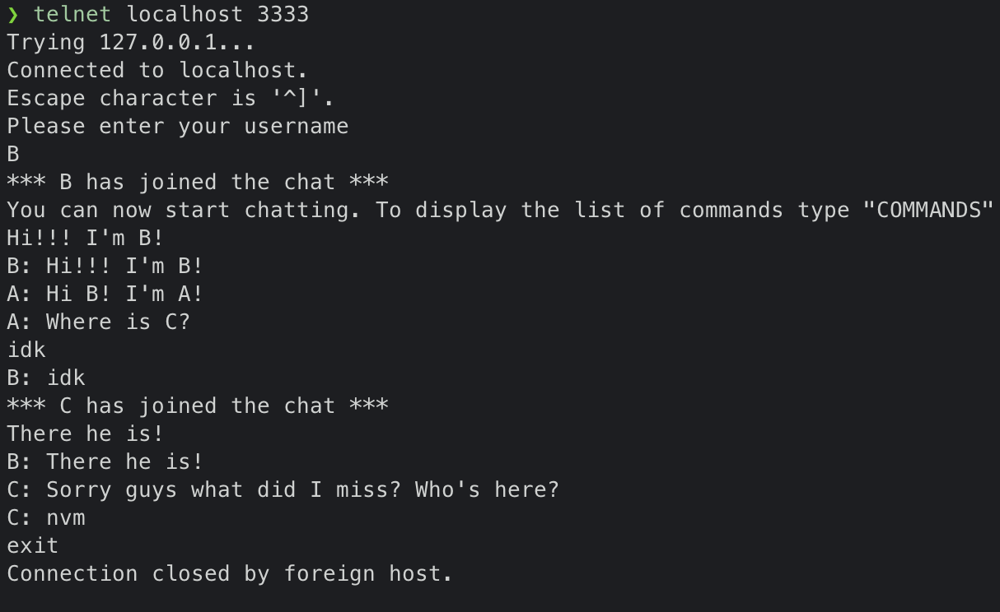
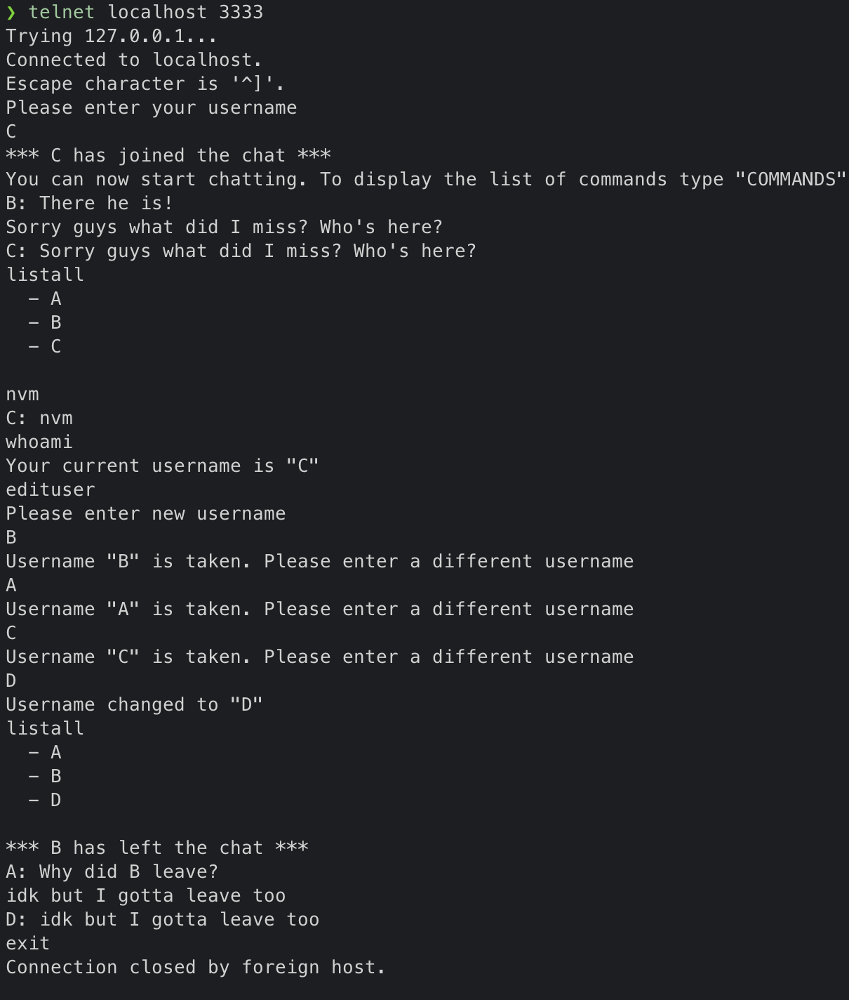

# ChatRoomServer
Simple chat room server program implemented in Java.

This is a multi-threaded server program that listens on a port for a new connection and maintains a list of all the active connections while synchronizing access to said list using locks.

The purpose of this assignment was to learn about multi-threading and networking concepts.

## Protocol for client-server communication

| Client Request  | Server Response |       Meaning      |
| ------------- | ------------- | :---------- |
| Join chatroom with valid ID/Username **u** | Welcome message | <ul><li>Add client to chat room</li><li>Broadcast message to all chat room participants indicating client *joined* the chat room</li></ul>  |
| COMMANDS | List of commands | <ul><li>Display private message to client listing all commands</li></ul>|
| LISTALL | List of current participants | <ul><li>Display private message to client listing all current participants in the chat room (including itself)</li></ul> |
| COUNTALL | Number of current participants | <ul><li>Display private message to client  indicating the current number of participants in the chat room (including itself)</li></ul> |
| WHOAMI | Current username | <ul><li>Display private message to client with its current username</li></ul> |
| EDITUSER **u** | Username change confirmation message | <ul><li>Validate **u** (no two clients with the same username in a chatroom)</li><li>Change client's username to **u**</li><li>Display private message to client confirming username change</li></ul> |
| EXIT | Exit message | <ul><li>Remove client from chat room</li><li>Broadcast message to all chat room participants indicating client *left* the chat room</li><li>Quit the connection</li></ul> |
| Any other input line after joining chatroom **message** | Chat message | <ul><li>Broadcast message to all chatroom participants in the form of “[**u**]: [**message**]”</li></ul> |

## Snapshots

#### Client A

#### Client B

#### Client C

## Running Locally (Manual Setup)

Use Eclipse to clone the repository and run program to establish test connection with server.

Use Telnet as client to connect to server.

1. Install [Eclipse IDE](http://www.eclipse.org/downloads/).
2. Open Eclipse and go to **File** > **Import...**
3. In the *Import* window, select **Git** > **Projects from Git** and click **Next**.
4. In the *Select Repository Source* window, select **Clone URI** and click **Next**.
5. In the *Source Git Repository* window, enter the URI ``https://github.com/LeanetAlfonso/ChatRoomServer.git`` and click **Next**.
6. In the *Branch Selection* window, select *main* and click **Next**.
7. In the *Local Destination* window, enter a local directory and click **Next**.
8. In the *Select a Wizard to use for importing projects* window, select **Import existing Eclipse projects** and click **Next**.
9. In the *Import Projects* window, select the project and click **Finish**.
10. Run *ChatRoomServer.Java*
11. Type ``telnet localhost 3333`` at the command line to connect to the chatroom server (you must [install Telnet](https://www.layerstack.com/resources/tutorials/Installing-telnet-on-Linux-and-Windows-Cloud-Servers) before you can run this command). Run the command from different windows to simulate multiple client connections.
